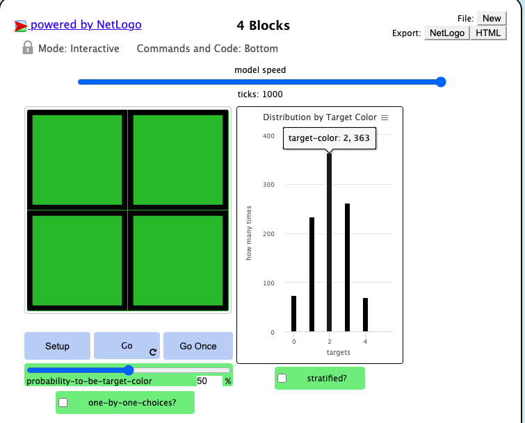
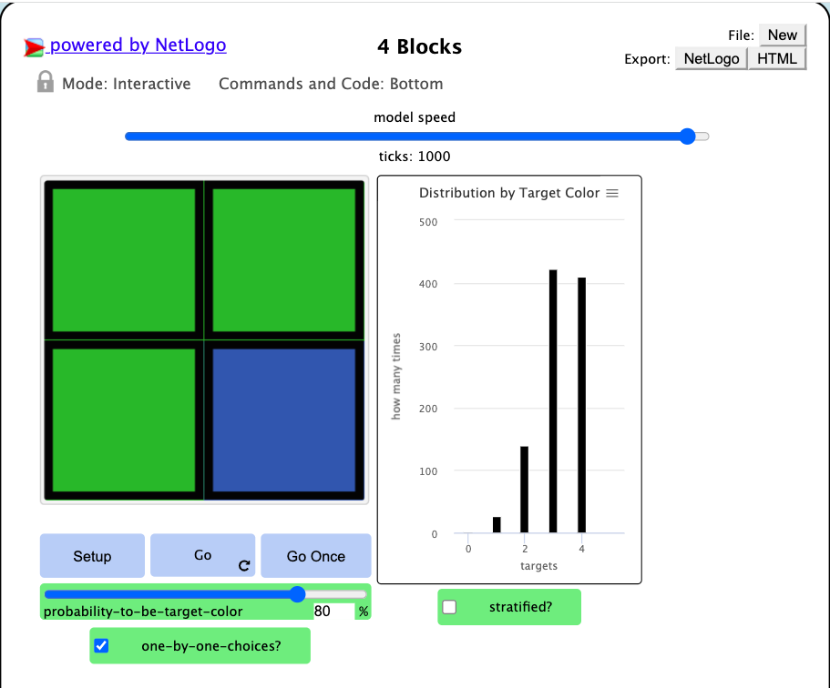
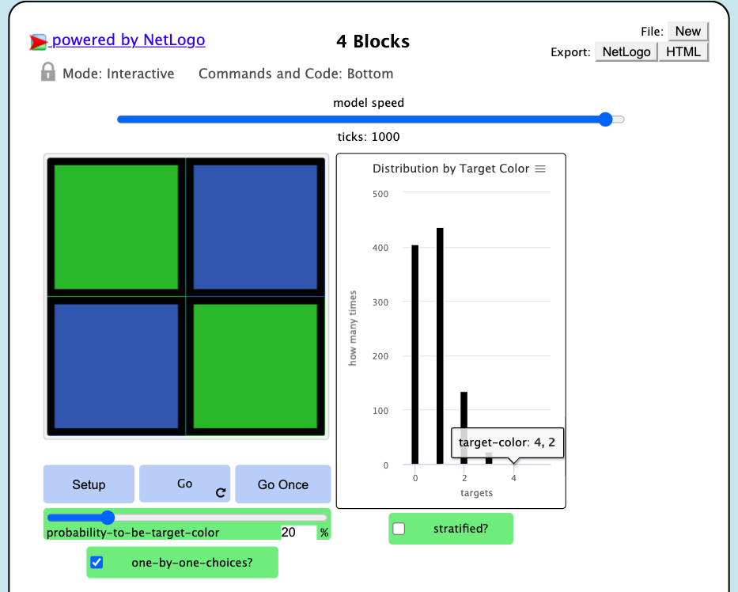

## Імітаційне моделювання комп'ютерних систем
## СПм-21-2, **Сергєєв Данило Андрійович**
### Лабораторная работа №**1**. Описание имитационных моделей

 

### Выбранная модель в среде NetLogo:
[4 Blocks](http://www.netlogoweb.org/launch#http://www.netlogoweb.org/assets/modelslib/Curricular%20Models/ProbLab/4%20Blocks.nlogo)

 

### Вербальное описание модели:
В4-Blocks имитирует вероятностный эксперимент, в котором случайным образом выпадают различные комбинации цветов четырех квадратов, каждый из которых может быть независимо зеленым или синим. Модель помогает нам понять отношения между теоретическими и практическими аспектами биномиальной функции: комбинаторным анализом (что мы можем получить) и экспериментированием (что мы действительно получаем).

### Управляющие параметры:
- **target-color other-color** определеяет сколько черепах будет участвовать в случайном блуждании.
- **PROBABILITY-TO-BE-TARGET-COLOR** определеяет вероятность зеленого цвета
- **ONE-BY-ONE-CHOICES** каждый квадрат будет останавливаться на своем цвете в разное время, а не одновременно

### Внутренние параметры:
- **target-color-list**. переменная, хранящая набор цветов
- **stratified-list**. подсчитывает количество вариаций (из 16)
- **stratified-indices**. М
- **target-color other-color**

### Критерии эффективности системы:
Теория свопадает с практиков

### Примечания:
При включенном режиме "stratified" каждый из пяти столбцов будет разделен на одну, четыре, шесть, четыре или одну подгруппу, в которой записано распределение внутри столбца пяти совокупных событий.

### Недостатки модели:
Невозможно добавить количество квадратов и цетов

 

## Вычислительные эксперименты

### 1. Анализ распределения результатов при заданной стандартной вероятности - 50%.

Проведем 5 эксперементов по 1000 шагов каждый.

<table>
<thead>
<tr><th>Номер эксперимента</th><th>Количество зеленх кваратов 0-1-2-3-4</th></tr>
</thead>
<tbody>
<tr><td>1</td><td>74-233-363-261-69</td></tr>
<tr><td>2</td><td>62-246-382-245-65</td></tr>
<tr><td>3</td><td>58-239-365-274-64</td></tr>
<tr><td>4</td><td>69-248-380-235-68</td></tr>
<tr><td>5</td><td>68-266-390-223-53</td></tr>
</tbody>
</table>

Посчитаем среднее арифмитическое каждого случая. 

<table>
<thead>
<tr><th>Количество зеленых квадратов </th><th>Среднее арифметическое</th></tr>
</thead>
<tbody>
<tr><td>0</td><td>331</td></tr>
<tr><td>1</td><td>1232</td></tr>
<tr><td>2</td><td>1880</td></tr>
<tr><td>3</td><td>1238</td></tr>
<tr><td>4</td><td>319</td></tr>
</tbody>
</table>

Результат: Когда вероятность получения зеленого квадрата установлена на уровне 50%, возникающее эмпирическое распределение будет динамически сходиться к распределению 1:4:6:4:1 ≈ (331:1232:1880:1238:319)

### 2. Влияние увелечение вероятности выпадения зеленого квадрата на распределение

Увеличим вероятность до 80%. Проведем 5 эксперементов по 1000 шагов каждый.

<table>
<thead>
<tr><th>Номер эксперимента</th><th>Количество зеленх кваратов 0-1-2-3-4</th></tr>
</thead>
<tbody>
<tr><td>1</td><td>2-26-139-423-410</td></tr>
<tr><td>2</td><td>1-30-162-393-414</td></tr>
<tr><td>3</td><td>1-25-151-417-406</td></tr>
<tr><td>4</td><td>0-27-153-420-400</td></tr>
<tr><td>5</td><td>1-27-165-397-410</td></tr>
</tbody>
</table>

Посчитаем среднее арифмитическое каждого случая. 

<table>
<thead>
<tr><th>Количество зеленых квадратов </th><th>Среднее арифметическое</th></tr>
</thead>
<tbody>
<tr><td>0</td><td>1</td></tr>
<tr><td>1</td><td>27</td></tr>
<tr><td>2</td><td>154</td></tr>
<tr><td>3</td><td>410</td></tr>
<tr><td>4</td><td>408</td></tr>
</tbody>
</table>

Результат: Когда вероятность получения зеленого квадрата установлена на 80%, возникающее эмпирическое распределение будет смещаться
0:1:6:16:16(1:26:154:410:408)

### 3. Влияние уменьшение вероятности выпадения зеленого квадрата на распределение

Уменьшим вероятность до 20%. Проведем 5 эксперементов по 1000 шагов каждый.

<table>
<thead>
<tr><th>Номер эксперимента</th><th>Количество зеленх кваратов 0-1-2-3-4</th></tr>
</thead>
<tbody>
<tr><td>1</td><td>405-436-134-23-2</td></tr>
<tr><td>2</td><td>406-422-146-24-2</td></tr>
<tr><td>3</td><td>413-417-150-19-1</td></tr>
<tr><td>4</td><td>410-393-159-37-1</td></tr>
<tr><td>5</td><td>393-434-146-27-0</td></tr>
</tbody>
</table>

Посчитаем среднее арифмитическое каждого случая. 

<table>
<thead>
<tr><th>Количество зеленых квадратов </th><th>Среднее арифметическое</th></tr>
</thead>
<tbody>
<tr><td>0</td><td>405,4</td></tr>
<tr><td>1</td><td>420,4</td></tr>
<tr><td>2</td><td>147</td></tr>
<tr><td>3</td><td>26</td></tr>
<tr><td>4</td><td>1,2</td></tr>
</tbody>
</table>

Результат: Когда вероятность получения зеленого квадрата установлена на 20%, возникающее эмпирическое распределение будет смещаться, но уже в другую сторону
16:16:6:1:0 ≈ (405,4:420,4:147:26:1,2)
